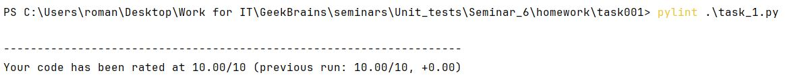
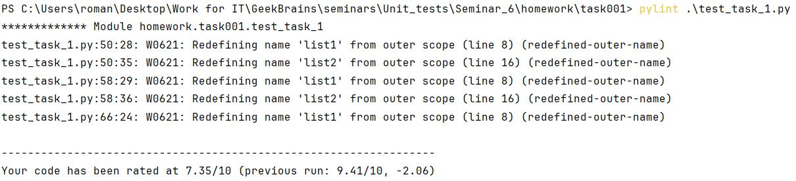
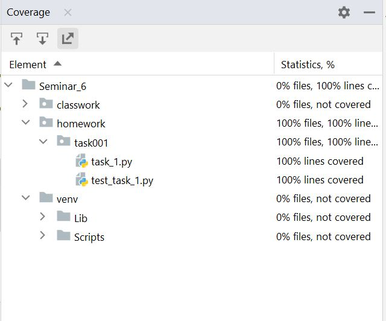

# Урок 6. Юнит тестирование в других языках

## Classwork

### task001:

1. Написание кода калькулятора;
2. Написание тестов;
3. Запуск тестов и проверка линтеров.

### task002:

1. Написание тестов;
2. Запуск тестов и проверка линтеров.

Задание №1
Напишите функцию для поиска среднего значения в списке чисел и соответствующие юниттесты с использованием фреймворка
pytest.

Задание №2
Модифицируйте функцию find_average так, чтобы она вызывала исключение TypeError, если
ей передается не список.
Напишите тест, который проверяет вызов этого исключения.

Задание №3
Создайте два класса: Person и Bank. Класс Person должен иметь метод transfer_money,
который позволяет перевести деньги в Bank. Класс Bank должен иметь метод
receive_money.
Напишите тесты, проверяющие корректность взаимодействия этих классов.

Задание №4
В предыдущем задании используйте unittest.mock для создания мок-объекта Bank.
Напишите тест, в котором вы проверите, вызывается ли метод receive_money с правильным
аргументом.

Задание №5
Напишите функцию divide(a, b), которая возвращает результат деления a на b. Если b равно нулю, функция
должна вызывать исключение ZeroDivisionError.
Напишите тест, который проверяет, что при попытке деления на ноль функция вызывает исключение
ZeroDivisionError.

Задание №6
Напишите функцию multiply(a, b), которая возвращает произведение a и b.
Затем напишите параметризованный тест, который проверяет эту функцию на нескольких наборах данных.

Задание №7
Напишите тест, который проверяет, что встроенная функция len возвращает корректную
длину строки

Задание №8
Создайте функцию square(n), которая возвращает квадрат числа n.
Напишите doctest, который проверяет работу этой функции.

Задание №9
Напишите функцию is_prime(n), которая проверяет, является ли число n простым.
Простое число - это число, которое делится только на 1 и на себя. Напишите
параметризованный тест с использованием pytest.mark.parametrize, который
проверяет эту функцию на нескольких наборах данных.

## Homework

### task001:

Задание 1. Создайте программу на Python или Java, которая принимает два списка чисел и выполняет следующие действия:
a. Рассчитывает среднее значение каждого списка.
b. Сравнивает эти средние значения и выводит соответствующее сообщение:

- ""Первый список имеет большее среднее значение"", если среднее значение первого списка больше.
- ""Второй список имеет большее среднее значение"", если среднее значение второго списка больше.
- ""Средние значения равны"", если средние значения списков равны.

Важно:
Приложение должно быть написано в соответствии с принципами объектно-ориентированного программирования.
Используйте Pytest (для Python) или JUnit (для Java) для написания тестов, которые проверяют правильность работы
программы. Тесты должны учитывать различные сценарии использования вашего приложения.
Используйте pylint (для Python) или Checkstyle (для Java) для проверки качества кода.

#### Решение:

Сгенерируйте отчет о покрытии кода тестами. Ваша цель - достичь минимум 90% покрытия.

#### Решение:

Объяснение того, какие сценарии покрыты тестами и почему вы выбрали именно эти сценарии.

#### Решение:

К каждой функции прикреплена документация. Данные сценарии выбраны так как в них наиболее вероятна ошибка.